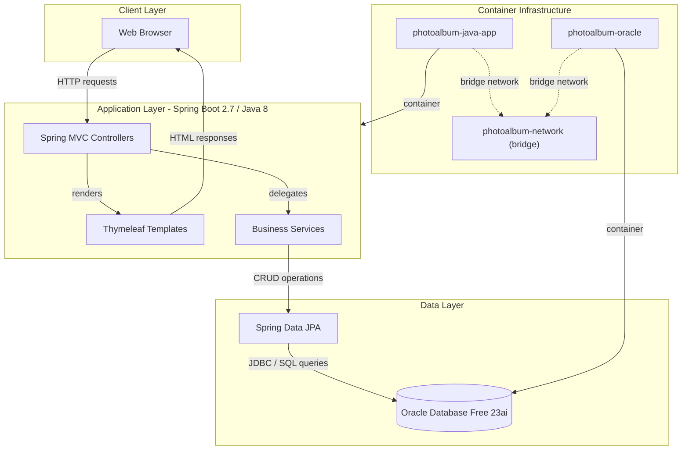
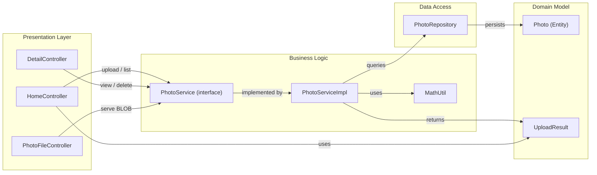

# Architecture Diagram

A Spring Boot 2.7 Java web application for photo storage and gallery management, using Oracle Database for BLOB storage and Thymeleaf for server-side rendering.

## Application Architecture

## Component Relationships

