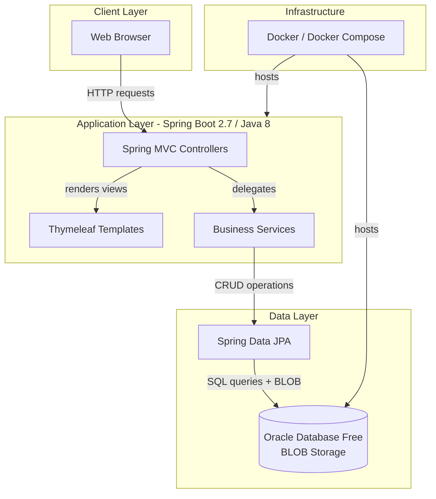
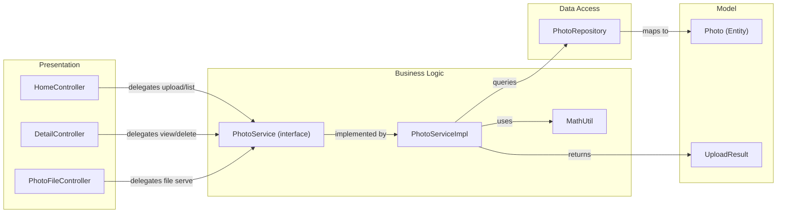

# Architecture Diagram

A Spring Boot 2.7 photo gallery application with Oracle Database BLOB storage, serving photo uploads and retrieval via Thymeleaf-rendered web pages.

## Application Architecture

## Component Relationships

