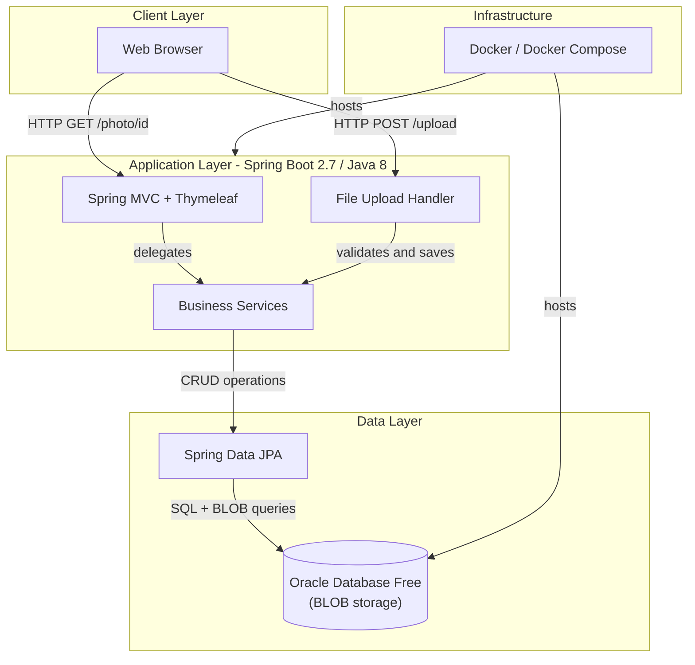
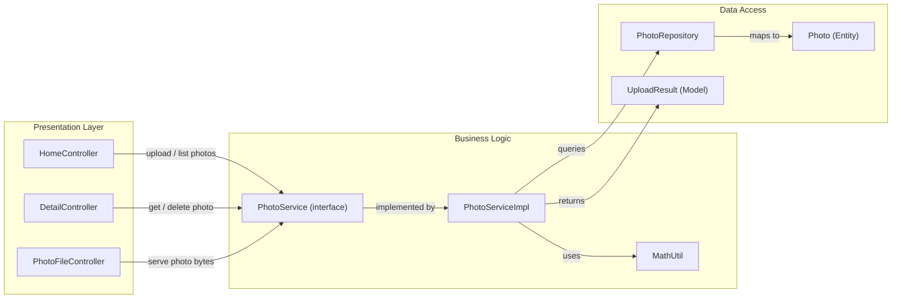

# Architecture Diagram

A Spring Boot 2.7 web application that stores and serves photos using Oracle Database BLOB storage, with Thymeleaf-based server-side rendering and a RESTful upload API.

## Application Architecture

## Component Relationships

