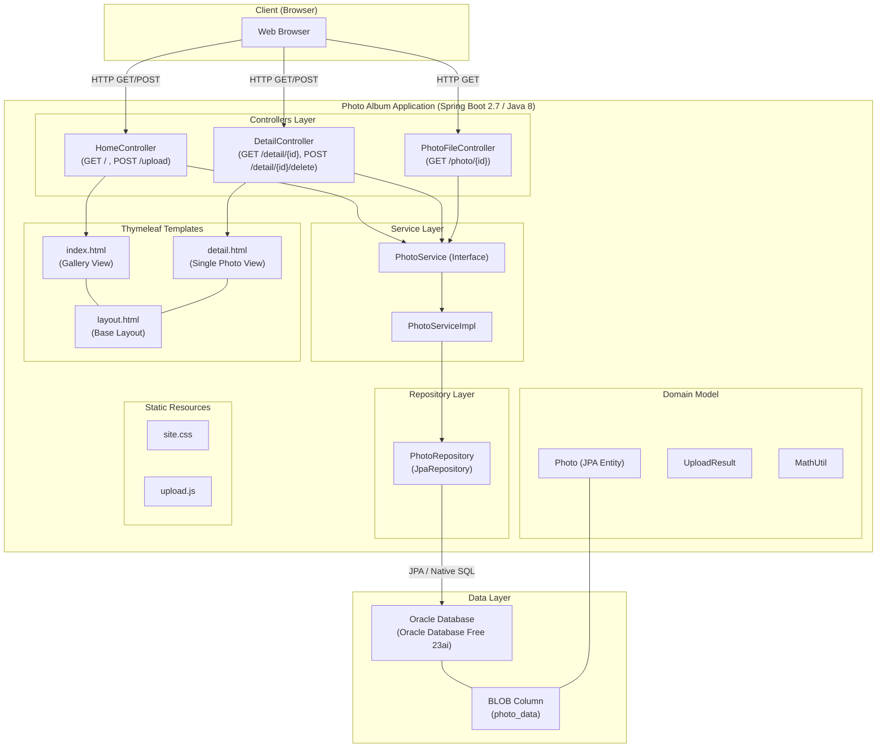
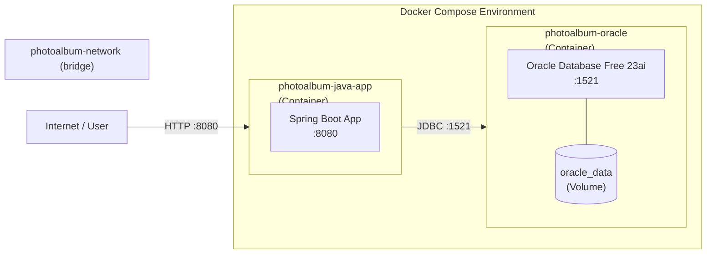

# Architecture Diagram

## Application Architecture

## Deployment Architecture

## Technology Stack

| Layer | Technology | Version |
|-------|-----------|---------|
| Language | Java | 8 |
| Framework | Spring Boot | 2.7.18 |
| Web | Spring MVC + Thymeleaf | 2.7.18 |
| Persistence | Spring Data JPA + Hibernate | 2.7.18 |
| Database | Oracle Database Free | 23ai |
| JDBC Driver | ojdbc8 | runtime |
| Build Tool | Maven | 3.9.6 |
| Container | Docker + Docker Compose | latest |
| Base Image (build) | eclipse-temurin:8 | JDK 8 |
| Base Image (runtime) | eclipse-temurin:8-jre | JRE 8 |
