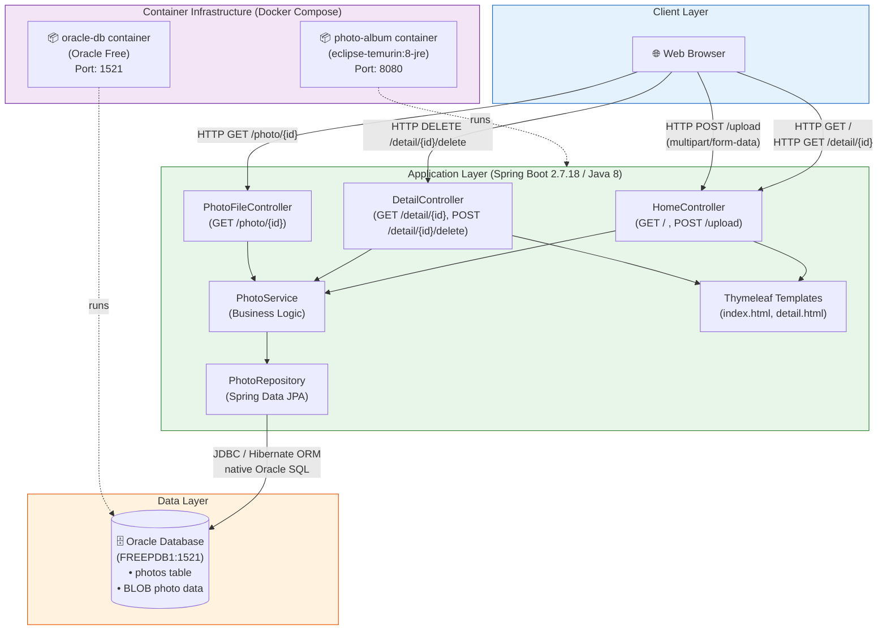

# Architecture Diagram

This diagram illustrates the high-level architecture of the Photo Album application and its deployment environment.

## Architecture Notes

| Component | Technology | Details |
|-----------|-----------|---------|
| **Runtime** | Java 8 (Eclipse Temurin) | EOL – upgrade to Java 17/21 recommended |
| **Framework** | Spring Boot 2.7.18 | EOL (Nov 2023) – upgrade to Spring Boot 3.x recommended |
| **Web Layer** | Spring MVC + Thymeleaf 3 | Server-side rendering |
| **Persistence** | Spring Data JPA + Hibernate | Uses Oracle dialect and native queries |
| **Database** | Oracle Database Free (21c) | Connected via JDBC at `oracle-db:1521/FREEPDB1` |
| **Photo Storage** | Oracle BLOB column | Binary data stored directly in the `photos` table |
| **Containerization** | Docker + Docker Compose | Multi-stage build, `maven:3.9.6` for build, `eclipse-temurin:8-jre` for runtime |

## Cloud Migration Targets

The application is assessed for migration to the following Azure services:

- **Azure App Service** – Managed PaaS for web applications
- **Azure Kubernetes Service (AKS)** – Container orchestration
- **Azure Container Apps** – Serverless container hosting
