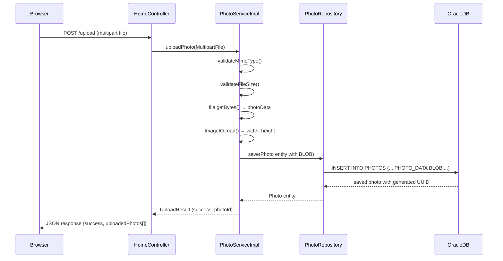
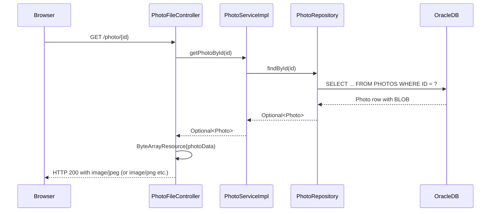

# Component Relationship Diagram

This diagram shows the internal component structure and the relationships between layers in the Photo Album application.

```mermaid
graph TB
    subgraph Presentation["Presentation Layer"]
        direction LR
        IndexHTML["index.html\n(Thymeleaf)\nGallery view + upload form"]
        DetailHTML["detail.html\n(Thymeleaf)\nFull-size photo + navigation"]
    end

    subgraph Controllers["Controller Layer (Spring MVC)"]
        direction TB
        HomeCtrl["HomeController\n──────────────\n+ index(Model) : String\n+ uploadPhotos(List&lt;MultipartFile&gt;) : ResponseEntity"]
        DetailCtrl["DetailController\n──────────────\n+ detail(id, Model) : String\n+ deletePhoto(id, RedirectAttributes) : String"]
        PhotoFileCtrl["PhotoFileController\n──────────────\n+ servePhoto(id) : ResponseEntity&lt;Resource&gt;"]
    end

    subgraph Services["Service Layer"]
        PhotoServiceIface["&lt;&lt;interface&gt;&gt;\nPhotoService\n──────────────\n+ getAllPhotos()\n+ getPhotoById(id)\n+ uploadPhoto(file)\n+ deletePhoto(id)\n+ getPreviousPhoto(photo)\n+ getNextPhoto(photo)"]
        PhotoServiceImpl["PhotoServiceImpl\n──────────────\n- photoRepository\n- maxFileSizeBytes\n- allowedMimeTypes\n──────────────\n+ uploadPhoto(file)\n+ validateMimeType()\n+ validateFileSize()\n+ extractDimensions()"]
    end

    subgraph Repository["Repository Layer (Spring Data JPA)"]
        PhotoRepo["PhotoRepository\n&lt;&lt;extends JpaRepository&gt;&gt;\n──────────────\n+ findAllOrderByUploadedAtDesc()\n+ findPhotosUploadedBefore(date)\n+ findPhotosUploadedAfter(date)\n+ findPhotosByUploadMonth(yr,mo)\n+ findPhotosWithPagination(s,e)\n+ findPhotosWithStatistics()"]
    end

    subgraph Models["Domain Model"]
        Photo["Photo\n&lt;&lt;@Entity&gt;&gt;\n──────────────\n- id : String (UUID)\n- originalFileName : String\n- photoData : byte[] (@Lob)\n- storedFileName : String\n- filePath : String\n- fileSize : Long\n- mimeType : String\n- uploadedAt : LocalDateTime\n- width : Integer\n- height : Integer"]
        UploadResult["UploadResult\n──────────────\n- success : boolean\n- photoId : String\n- fileName : String\n- errorMessage : String"]
        MathUtil["MathUtil\n──────────────\n(utility class)"]
    end

    subgraph Database["Database (Oracle)"]
        PhotosTable[("PHOTOS table\n──────────────\nID (VARCHAR2 36)\nORIGINAL_FILE_NAME\nPHOTO_DATA (BLOB)\nSTORED_FILE_NAME\nFILE_PATH\nFILE_SIZE (NUMBER)\nMIME_TYPE\nUPLOADED_AT (TIMESTAMP)\nWIDTH (NUMBER)\nHEIGHT (NUMBER)")]
    end

    %% Presentation -> Controllers
    IndexHTML -.->|"renders"| HomeCtrl
    DetailHTML -.->|"renders"| DetailCtrl

    %% Controllers -> Services
    HomeCtrl --> PhotoServiceIface
    DetailCtrl --> PhotoServiceIface
    PhotoFileCtrl --> PhotoServiceIface

    %% Services -> Implementation
    PhotoServiceIface <|.. PhotoServiceImpl

    %% Services -> Repository
    PhotoServiceImpl --> PhotoRepo

    %% Services -> Models
    PhotoServiceImpl --> Photo
    PhotoServiceImpl --> UploadResult

    %% Repository -> DB
    PhotoRepo --> PhotosTable

    %% Repository -> Model
    PhotoRepo --> Photo

    style Presentation fill:#e3f2fd,stroke:#1565c0
    style Controllers fill:#e8f5e9,stroke:#2e7d32
    style Services fill:#fff9c4,stroke:#f9a825
    style Repository fill:#fce4ec,stroke:#c62828
    style Models fill:#f3e5f5,stroke:#6a1b9a
    style Database fill:#fff3e0,stroke:#e65100
```

## Component Descriptions

### Controllers

| Component | Route | Responsibility |
|-----------|-------|---------------|
| `HomeController` | `GET /` | Loads all photos for the gallery view |
| `HomeController` | `POST /upload` | Handles multi-file upload (returns JSON) |
| `DetailController` | `GET /detail/{id}` | Displays a single photo with prev/next navigation |
| `DetailController` | `POST /detail/{id}/delete` | Deletes a photo and redirects to gallery |
| `PhotoFileController` | `GET /photo/{id}` | Streams photo binary data from Oracle BLOB |

### Services

| Component | Responsibility |
|-----------|---------------|
| `PhotoService` | Interface defining photo business operations |
| `PhotoServiceImpl` | Validates uploads (MIME type, file size), stores BLOBs in Oracle, extracts image dimensions |

### Repository

| Component | Responsibility |
|-----------|---------------|
| `PhotoRepository` | Data access layer with Oracle-specific native SQL queries (ROWNUM, NVL, analytical functions) |

### Domain Model

| Component | Responsibility |
|-----------|---------------|
| `Photo` | JPA entity mapping to `PHOTOS` table; stores binary photo data as BLOB |
| `UploadResult` | DTO capturing upload outcome (success/failure, photo ID, error message) |
| `MathUtil` | Utility class |

## Data Flow: Photo Upload



## Data Flow: Photo Retrieval


