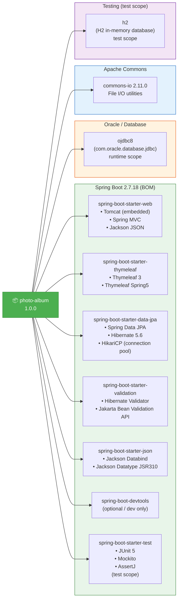

# Dependency Map

This diagram shows the external dependencies of the Photo Album application as defined in `pom.xml`.

## Dependency Details

### Runtime Dependencies

| Group | Artifact | Version | Scope | Notes |
|-------|----------|---------|-------|-------|
| `org.springframework.boot` | `spring-boot-starter-parent` | 2.7.18 | parent BOM | ⚠️ EOL Nov 2023 |
| `org.springframework.boot` | `spring-boot-starter-web` | (managed) | compile | Embedded Tomcat |
| `org.springframework.boot` | `spring-boot-starter-thymeleaf` | (managed) | compile | Server-side templating |
| `org.springframework.boot` | `spring-boot-starter-data-jpa` | (managed) | compile | JPA / Hibernate ORM |
| `org.springframework.boot` | `spring-boot-starter-validation` | (managed) | compile | Bean Validation |
| `org.springframework.boot` | `spring-boot-starter-json` | (managed) | compile | Jackson JSON |
| `com.oracle.database.jdbc` | `ojdbc8` | (managed) | runtime | ⚠️ Oracle proprietary JDBC |
| `commons-io` | `commons-io` | 2.11.0 | compile | Apache Commons I/O |

### Non-Production Dependencies

| Group | Artifact | Version | Scope | Notes |
|-------|----------|---------|-------|-------|
| `org.springframework.boot` | `spring-boot-devtools` | (managed) | optional | Dev live reload |
| `org.springframework.boot` | `spring-boot-starter-test` | (managed) | test | JUnit 5, Mockito |
| `com.h2database` | `h2` | (managed) | test | In-memory DB for tests |

## Key Dependency Concerns for Cloud Migration

| Concern | Dependency | Recommendation |
|---------|-----------|---------------|
| ⛔ **Java EE namespace** | `javax.persistence`, `javax.validation` | Upgrade to Spring Boot 3.x (uses Jakarta EE 10) |
| ⛔ **Spring Boot EOL** | `spring-boot-starter-parent:2.7.18` | Upgrade to Spring Boot 3.3.x or 3.4.x |
| ⛔ **Oracle proprietary driver** | `ojdbc8` | Migrate to PostgreSQL (`org.postgresql:postgresql`) or Azure SQL |
| ⚠️ **Binary BLOB storage** | Embedded in JPA/Hibernate | Consider Azure Blob Storage SDK (`azure-storage-blob`) |
| ✅ **Embedded web server** | Tomcat (via starter-web) | Good for containerized deployment |
| ✅ **Connection pooling** | HikariCP (via starter-data-jpa) | Good for cloud deployments |
| ✅ **Container-ready** | Docker + multi-stage build | Ready for AKS/ACA deployment |
