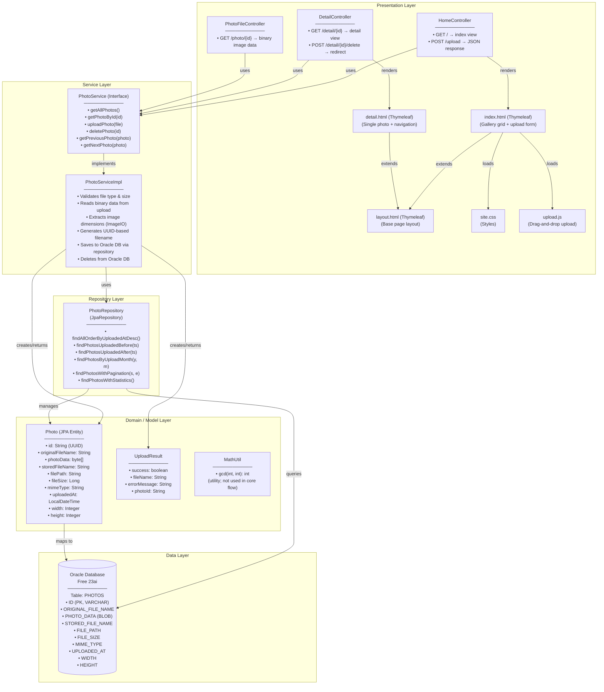
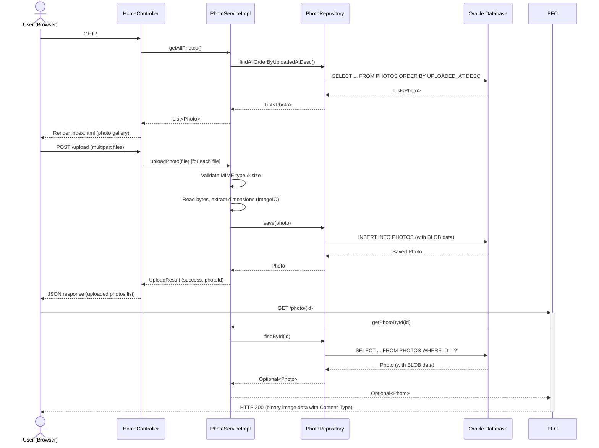

# Component Relationship Diagram

## Component Overview

## Request-Response Flow

## Component Coupling Analysis

| Component | Depends On | Coupling Type | Risk |
|-----------|-----------|---------------|------|
| HomeController | PhotoService, Photo, UploadResult | Interface (loose) | Low |
| DetailController | PhotoService, Photo | Interface (loose) | Low |
| PhotoFileController | PhotoService, Photo | Interface (loose) | Low |
| PhotoServiceImpl | PhotoRepository, Photo, UploadResult, ImageIO | Direct | Medium |
| PhotoRepository | Photo, Oracle DB (native SQL) | Oracle-tight | High |
| Photo (Entity) | Oracle DB (OracleDialect, BLOB) | Oracle-tight | High |
| application.properties | Oracle JDBC URL, credentials | Hard-coded | Critical |
