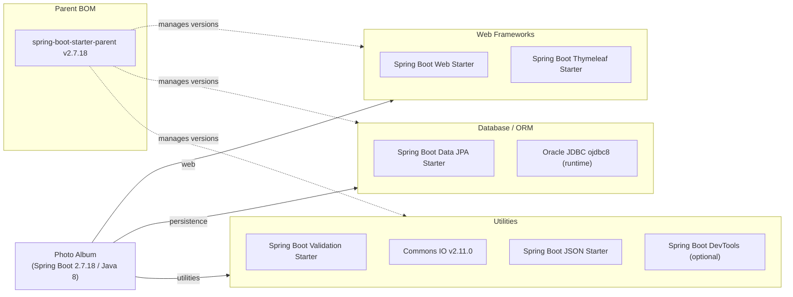

# Dependency Map

Photo Album is a Spring Boot 2.7 Java application with 8 declared runtime/compile-scope external dependencies managed via Maven.

## Dependencies

```mermaid
flowchart LR
    App["Photo Album\n(Spring Boot 2.7.18 / Java 8)"]

    subgraph BOM["Parent BOM"]
        SpringParent["spring-boot-starter-parent v2.7.18"]
    end
    subgraph Web["Web Frameworks"]
        SpringWeb["Spring Boot Web Starter"]
        Thymeleaf["Spring Boot Thymeleaf Starter"]
    end
    subgraph DB["Database / ORM"]
        DataJPA["Spring Boot Data JPA Starter"]
        OracleJDBC["Oracle JDBC ojdbc8 (runtime)"]
    end
    subgraph Util["Utilities"]
        Validation["Spring Boot Validation Starter"]
        CommonsIO["Commons IO v2.11.0"]
        SpringJSON["Spring Boot JSON Starter"]
        DevTools["Spring Boot DevTools (optional)"]
    end

    App -->|"web"| Web
    App -->|"persistence"| DB
    App -->|"utilities"| Util
    SpringParent -.->|"manages versions"| Web
    SpringParent -.->|"manages versions"| DB
    SpringParent -.->|"manages versions"| Util
```
