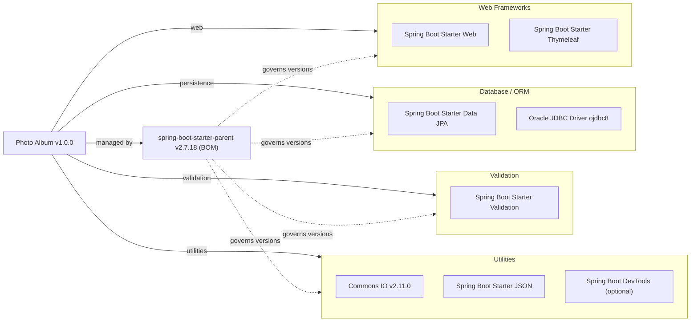

# Dependency Map

Photo Album is a Spring Boot 2.7 Java application with 8 declared runtime/compile dependencies managed via the Spring Boot parent BOM.

## Dependencies

```mermaid
flowchart LR
    App["Photo Album v1.0.0"]

    BOM["spring-boot-starter-parent v2.7.18 (BOM)"]

    subgraph Web["Web Frameworks"]
        SpringWeb["Spring Boot Starter Web"]
        Thymeleaf["Spring Boot Starter Thymeleaf"]
    end
    subgraph DB["Database / ORM"]
        DataJPA["Spring Boot Starter Data JPA"]
        OracleJDBC["Oracle JDBC Driver ojdbc8"]
    end
    subgraph Validation["Validation"]
        SpringVal["Spring Boot Starter Validation"]
    end
    subgraph Util["Utilities"]
        CommonsIO["Commons IO v2.11.0"]
        SpringJSON["Spring Boot Starter JSON"]
        DevTools["Spring Boot DevTools (optional)"]
    end

    App -->|"managed by"| BOM
    App -->|"web"| Web
    App -->|"persistence"| DB
    App -->|"validation"| Validation
    App -->|"utilities"| Util
    BOM -.->|"governs versions"| Web
    BOM -.->|"governs versions"| DB
    BOM -.->|"governs versions"| Validation
    BOM -.->|"governs versions"| Util
```
