# Dependency Map

## Maven Dependency Graph

```mermaid
graph TD
    subgraph App["photo-album (com.photoalbum:photo-album:1.0.0)"]
        direction TB
    end

    subgraph SpringBoot["Spring Boot 2.7.18 (via spring-boot-starter-parent)"]
        SBWeb["spring-boot-starter-web"]
        SBThyme["spring-boot-starter-thymeleaf"]
        SBJPA["spring-boot-starter-data-jpa"]
        SBValid["spring-boot-starter-validation"]
        SBJSON["spring-boot-starter-json"]
        SBTest["spring-boot-starter-test (test)"]
        SBDev["spring-boot-devtools (optional)"]
    end

    subgraph Transitive["Key Transitive Dependencies"]
        SpringMVC["spring-webmvc"]
        Thymeleaf["thymeleaf 3.x"]
        Hibernate["hibernate-core 5.6.x"]
        JPA["jakarta.persistence-api 2.2"]
        Valid8["hibernate-validator 6.x"]
        Jackson["jackson-databind 2.x"]
        SLF4J["slf4j-api + logback"]
        Tomcat["embedded-tomcat 9.x"]
        JUnit5["junit-jupiter 5.x"]
        Mockito["mockito-core 4.x"]
    end

    subgraph External["External / Third-Party Dependencies"]
        OJDBC["ojdbc8 (com.oracle.database.jdbc) [runtime]"]
        CommonsIO["commons-io 2.11.0"]
        H2["h2 (test scope)"]
    end

    App -->|compile| SBWeb
    App -->|compile| SBThyme
    App -->|compile| SBJPA
    App -->|compile| SBValid
    App -->|compile| SBJSON
    App -->|test| SBTest
    App -->|optional| SBDev
    App -->|runtime| OJDBC
    App -->|compile| CommonsIO
    App -->|test| H2

    SBWeb --> SpringMVC
    SBWeb --> Tomcat
    SBWeb --> Jackson
    SBWeb --> SLF4J
    SBThyme --> Thymeleaf
    SBJPA --> Hibernate
    SBJPA --> JPA
    SBValid --> Valid8
    SBJSON --> Jackson
    SBTest --> JUnit5
    SBTest --> Mockito
```

## Direct Dependencies

| Group | Artifact | Version | Scope | Notes |
|-------|----------|---------|-------|-------|
| org.springframework.boot | spring-boot-starter-web | 2.7.18 | compile | Web MVC + embedded Tomcat |
| org.springframework.boot | spring-boot-starter-thymeleaf | 2.7.18 | compile | Server-side templating |
| org.springframework.boot | spring-boot-starter-data-jpa | 2.7.18 | compile | JPA + Hibernate ORM |
| org.springframework.boot | spring-boot-starter-validation | 2.7.18 | compile | Bean Validation (JSR-380) |
| org.springframework.boot | spring-boot-starter-json | 2.7.18 | compile | Jackson JSON support |
| com.oracle.database.jdbc | ojdbc8 | (managed) | runtime | Oracle JDBC driver |
| commons-io | commons-io | 2.11.0 | compile | File I/O utilities |
| org.springframework.boot | spring-boot-starter-test | 2.7.18 | test | JUnit 5, Mockito, Spring Test |
| com.h2database | h2 | (managed) | test | In-memory DB for testing |
| org.springframework.boot | spring-boot-devtools | 2.7.18 | optional | Hot reload for development |

## Dependency Risk Analysis

| Dependency | Risk Level | Issue |
|------------|-----------|-------|
| Java 8 | 🔴 Critical | End of public updates; not supported on modern Azure services |
| Spring Boot 2.7.18 | 🔴 Critical | Past end-of-life (November 2023); no security updates |
| ojdbc8 (Oracle JDBC) | 🟠 High | Oracle-proprietary driver; prevents cloud database migration |
| javax.persistence (transitive via Hibernate 5) | 🟠 High | Replaced by jakarta.persistence in Spring Boot 3 / JEE 10 |
| hibernate-core 5.x | 🟠 High | Replaced by Hibernate 6.x in Spring Boot 3; different API |
| hibernate-validator 6.x | 🟡 Medium | Uses javax.validation; replaced by jakarta.validation in newer versions |
| commons-io 2.11.0 | 🟢 Low | Stable version; not a cloud migration blocker |
| h2 (test) | 🟢 Low | Used only in tests; no production impact |
